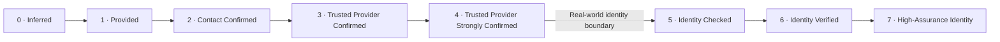

# Delegate Identity Levels

**Purpose:** A simple, user-friendly way to describe how much confidence Delegate has in the identity behind a website interaction.

Delegate Identity Levels are intended to help product teams answer questions such as:

- "Is an unconfirmed email address enough for this feature?"
- "Should we require a confirmed contact method?"
- "Should we prefer a well-known identity provider?"
- "Do we need strong authentication such as MFA or a passkey?"
- "Do we actually need to know the person's real-world identity?"

The levels intentionally combine the most useful parts of modern web identity into a single practical ladder, while retaining more detailed standards information underneath when needed.

> **Important:** Delegate Identity Levels describe **identity confidence**, not authorization.
>
> A user may be strongly identified but still not be authorized to perform an action. Roles, permissions, membership, entitlement, employment status, and other authorization decisions are separate.

---

## Summary

| Level | Name                                    | Plain-language meaning                                                                                                              | Typical evidence                                                                                 |
| ----- | --------------------------------------- | ----------------------------------------------------------------------------------------------------------------------------------- | ------------------------------------------------------------------------------------------------ |
| **0** | **Inferred**                            | We inferred information about this visitor, but the visitor has not confirmed it.                                                   | Cookies, device signals, IP-derived information, prior activity, probabilistic matching          |
| **1** | **Provided**                            | The visitor supplied identity or contact information, but it has not been confirmed.                                                | Entered name, email, phone, address, organization                                                |
| **2** | **Contact Confirmed**                   | The visitor demonstrated control of a contact method.                                                                               | Email link/code, SMS code, phone challenge                                                       |
| **3** | **Trusted Provider Confirmed**          | A trusted identity provider authenticated the visitor and confirmed a stable digital identity.                                      | Google, Apple, Microsoft, or another accepted OpenID Connect / federated identity provider       |
| **4** | **Trusted Provider Strongly Confirmed** | A trusted identity provider authenticated the visitor using a strong authentication method for the relevant session or transaction. | MFA, passkey, security key, or another sufficiently strong provider-authenticated method         |
| **5** | **Identity Checked**                    | The person's claimed real-world identity has been checked against trusted evidence or records.                                      | Validated identity attributes, authoritative or credible data sources                            |
| **6** | **Identity Verified**                   | Strong evidence establishes that the visitor is the real-world person they claim to be.                                             | Government ID or equivalent strong evidence plus ownership/holder verification                   |
| **7** | **High-Assurance Identity**             | The person's real-world identity has been established using a highest-assurance identity-proofing process.                          | Rigorous proofing, attended verification, strong evidence, biometric verification where required |

---

## The Most Important Boundary

Delegate treats Levels **0–4** and Levels **5–7** as fundamentally different categories.

```text
            DIGITAL / PSEUDONYMOUS IDENTITY                     REAL-WORLD IDENTITY
┌──────────────────────────────────────────────────┐   ┌─────────────────────────────────┐
│ 0       1        2         3          4          │   │ 5          6             7      │
│ Inferred → Provided → Contact → Trusted → Strong │   │ Checked → Verified → High      │
│                    Confirmed  Provider   Provider │   │                    Assurance    │
└──────────────────────────────────────────────────┘   └─────────────────────────────────┘

        "How sure are we this is the same                    "How sure are we that
          digital person/controller?"                       this is Bob Smith?"
```

A person can legitimately reach **Level 4 while remaining anonymous or pseudonymous**.

For example, Delegate may be highly confident that:

- the visitor controls a particular Google identity;
- that Google identity has a stable provider identifier;
- Google strongly authenticated the visitor using MFA or a passkey; and
- the current authentication is fresh enough for the intended use.

Delegate still may have **no basis for asserting that the visitor's legal name is Bob Smith**.

That transition begins at **Level 5**.

---

# Level Definitions

## Level 0 — Inferred

### Meaning

Delegate has information that appears to relate to the visitor, but the visitor has neither supplied nor confirmed it.

### Examples

- IP-derived country or approximate location
- browser or device characteristics
- first-party cookies
- previous browsing behavior
- a probabilistic match to a prior visitor
- inferred organization based on network or domain information
- marketing or enrichment information associated with the visit

### What this establishes

Very little about identity.

Level 0 may be useful for personalization, analytics, fraud signals, or deciding what information to ask for next.

### What it does **not** establish

- that the information is accurate;
- that the visitor agrees with it;
- that the visitor controls a particular contact method;
- that this is the same person as a previous visit;
- that a real-world identity is known.

---

## Level 1 — Provided

### Meaning

The visitor has directly supplied identity or contact information, but Delegate has not independently confirmed it.

### Examples

A visitor enters:

```text
Name: Bob Smith
Email: bob@example.com
Phone: +1 555 555 0100
```

Delegate knows that the visitor **said** these things.

Delegate does not yet know whether any of them are true.

### What this establishes

A self-asserted identity or contact point.

### Suitable uses

Level 1 can be useful when incorrect information creates little or no harm, such as:

- personalization;
- lead capture;
- non-sensitive forms;
- voluntary profile information.

### Caution

A supplied email address should not be interpreted as evidence that the visitor controls that email address.

---

## Level 2 — Contact Confirmed

### Meaning

The visitor has demonstrated control of at least one contact mechanism.

### Examples

- clicking a link sent to an email address;
- entering a code sent by email;
- entering a code sent by SMS;
- completing a telephone challenge.

### What this establishes

If Delegate sends a code to:

```text
bob@example.com
```

and the visitor successfully returns it, Delegate has reasonable evidence that the visitor currently has access to `bob@example.com`.

### What this does **not** establish

It does **not** establish that the visitor is Bob Smith.

This distinction is critical:

```text
"Controls bob@example.com"  ≠  "Is Bob Smith"
```

An email address or phone number is a communication mechanism. Confirming control of that mechanism is useful, but it is not real-world identity proofing.

### OpenID analogy

OpenID Connect includes claims such as:

- `email_verified`
- `phone_number_verified`

These similarly distinguish a verified communication channel from broader real-world identity verification.

---

## Level 3 — Trusted Provider Confirmed

### Meaning

A trusted identity provider has authenticated the visitor and supplied Delegate with a stable digital identity that Delegate accepts.

Examples may include:

- Google
- Apple
- Microsoft
- an organization's enterprise identity provider
- another approved OpenID Connect or federation provider

### Why this is stronger than Level 2

Level 2 establishes:

> "This visitor can receive a message at this contact point."

Level 3 establishes something closer to:

> "A trusted provider recognizes and authenticated this visitor as the controller of this established digital identity."

For OpenID Connect, Delegate should normally identify the provider identity using the combination of the trusted issuer and the provider's stable subject identifier, rather than relying solely on an email address.

Conceptually:

```text
issuer  = https://trusted-provider.example
subject = 248289761001

Delegate identity key = issuer + subject
```

An email address may change. The provider subject identifier is intended to identify the provider-side digital identity.

### Requirements for a "Trusted Provider"

Delegate should maintain an explicit provider trust policy.

A provider should not qualify for Level 3 merely because it supports OAuth or OpenID Connect.

Delegate should consider:

- provider reputation and operational maturity;
- secure OIDC/federation implementation;
- cryptographically verifiable assertions;
- appropriate issuer and audience validation;
- stable subject identifiers;
- documented account recovery practices;
- availability and meaning of relevant identity claims;
- whether Delegate understands the provider's security semantics.

### What this establishes

Strong confidence in a persistent **digital identity**.

### What this does **not** establish

It still does not necessarily establish a legal or physical identity.

A highly trusted Google identity named "Bob Smith" does not, by itself, prove that the human is legally Bob Smith.

---

## Level 4 — Trusted Provider Strongly Confirmed

### Meaning

A trusted provider has authenticated the visitor using a sufficiently strong authentication process for the relevant authentication event, session, or transaction.

Typical qualifying mechanisms may include:

- multi-factor authentication;
- a passkey;
- a FIDO/WebAuthn security key;
- another cryptographic authenticator;
- another provider-specific authentication method that Delegate's policy recognizes as sufficiently strong.

### The key distinction from Level 3

**Level 3:**

> We trust the provider's assertion that this is the controller of this digital identity.

**Level 4:**

> We trust the provider's assertion, and we also have evidence that the provider strongly authenticated that controller.

### Strong authentication must be demonstrated

Delegate should **not** award Level 4 simply because:

- the provider supports MFA;
- the user's provider account is capable of MFA;
- a passkey happens to be registered;
- the provider is a large or well-known company.

Instead, Delegate should have sufficient evidence that the required authentication strength was satisfied for the relevant authentication event.

Depending on the provider, this may come from:

- OpenID Connect `acr`;
- OpenID Connect `amr`;
- `auth_time`;
- provider-specific authentication context;
- an equivalent trusted assertion.

### OpenID terminology

OpenID Connect defines:

- `acr` — the authentication context/class that was satisfied;
- `amr` — the authentication methods used.

An `amr` value might, for example, indicate that password and OTP methods were used.

Modern OpenID specifications also define authentication contexts for phishing-resistant authentication.

### Not all Level 4 authentication is equally strong

Delegate should retain detailed properties below the friendly level.

For example:

```yaml
identity_level: 4

authentication:
  provider: google
  multifactor: true
  phishing_resistant: true
  cryptographic: true
  authenticated_at: 2026-09-13T13:30:00Z
```

This avoids creating Levels 4.1, 4.2, 4.3, and so on.

Level 4 is the user-friendly category.

The detailed characteristics remain available to policies that care about them.

### Examples

| Authentication                                                           | Delegate level | Notes                                      |
| ------------------------------------------------------------------------ | -------------- | ------------------------------------------ |
| Trusted provider, authentication strength unknown                        | 3              | Provider identity confirmed                |
| Trusted provider + password only                                         | 3              | Usually not enough for Level 4             |
| Trusted provider + password + OTP                                        | 4              | Stronger authentication / MFA              |
| Trusted provider + passkey                                               | 4              | Cryptographic; commonly phishing-resistant |
| Trusted provider + hardware security key                                 | 4              | Strong cryptographic authentication        |
| Provider supports MFA, but Delegate cannot determine whether it was used | 3              | Do not infer Level 4                       |

---

# The Real-World Identity Boundary

Starting with Level 5, Delegate is no longer primarily answering:

> "Who controls this digital identity?"

It is answering:

> "What real-world person does this identity represent?"

This is the domain that NIST calls **identity proofing** and describes with **Identity Assurance Levels (IALs)**.

---

## Level 5 — Identity Checked

### Meaning

Delegate has evidence supporting the existence of the claimed real-world identity and has taken steps to associate the visitor with that identity.

### Typical techniques

Depending on the implementation, these might include:

- checking identifying attributes against authoritative or credible sources;
- validating identity evidence;
- confirming name, date of birth, address, or other core identity information;
- checking evidence ownership using an accepted process.

### Standards relationship

This level is conceptually aligned with **NIST IAL1**.

Current NIST SP 800-63A-4 describes IAL1 as supporting the real-world existence of a claimed identity, validating core attributes against authoritative or credible sources, and taking steps to associate those attributes with the person undergoing proofing.

### Important wording

Delegate should use:

> **Identity Checked**

rather than:

> **Identity Verified**

at this level.

The goal is to communicate that meaningful real-world proofing has begun without overstating the rigor of the process.

---

## Level 6 — Identity Verified

### Meaning

Delegate has high confidence that the visitor is the real-world person they claim to be, based on stronger identity evidence and a more rigorous verification process.

### Examples

Depending on the proofing provider and policy:

- government-issued identification;
- passport;
- driver's license;
- authoritative digital identity evidence;
- multiple strong sources;
- document authenticity validation;
- evidence ownership checks;
- biometric or non-biometric holder verification.

### Standards relationship

This level is conceptually aligned with **NIST IAL2**.

NIST IAL2 requires additional evidence and more rigorous evidence validation and identity verification than IAL1.

### Important note

A process should only be described as **NIST IAL2 compliant** when it actually satisfies the applicable NIST requirements.

Delegate Level 6 may be **mapped to** or **inspired by** IAL2 without automatically constituting a compliance claim.

---

## Level 7 — High-Assurance Identity

### Meaning

The visitor's real-world identity has been established using the strongest identity-proofing process recognized by Delegate.

### Typical characteristics

These can include:

- strong identity evidence;
- tightly controlled validation processes;
- attended identity proofing;
- trained proofing personnel;
- biometric collection and comparison;
- rigorous controls against impersonation.

### Standards relationship

This level is conceptually aligned with **NIST IAL3**.

NIST SP 800-63A-4 requires IAL3 proofing to be on-site attended by a proofing agent and requires biometric information as part of the process.

---

# Visual Model



### What confidence increases at each step?

```text
Level 0   "We inferred this."
   │
Level 1   "You told us this."
   │
Level 2   "You control this contact method."
   │
Level 3   "A trusted provider confirms this digital identity."
   │
Level 4   "A trusted provider strongly authenticated this digital identity."
   │
   ├──────────── REAL-WORLD IDENTITY BOUNDARY ────────────
   │
Level 5   "Trusted evidence supports this claimed real-world identity."
   │
Level 6   "Strong evidence verifies this real-world identity."
   │
Level 7   "This identity passed a highest-assurance proofing process."
```

---

# Relationship to NIST

Delegate Identity Levels are intentionally easier to use than the underlying NIST model.

NIST SP 800-63-4 separates digital identity into multiple dimensions:

| NIST concept                            | Question it answers                                                                                        |
| --------------------------------------- | ---------------------------------------------------------------------------------------------------------- |
| **IAL — Identity Assurance Level**      | How confident are we that the claimed real-world identity is the person's real identity?                   |
| **AAL — Authenticator Assurance Level** | How confident are we that the current claimant controls the authenticators associated with the subscriber? |
| **FAL — Federation Assurance Level**    | How strongly is the federated assertion protected between identity provider and relying party?             |

Delegate does **not** attempt to replace these standards.

Instead, Delegate Identity Levels provide a simple decision-making layer over them.

### Approximate conceptual mapping

| Delegate level                              | Primary concept                     | Approximate standards relationship                        |
| ------------------------------------------- | ----------------------------------- | --------------------------------------------------------- |
| **0 — Inferred**                            | Inference                           | No identity proofing                                      |
| **1 — Provided**                            | Self-assertion                      | No identity proofing                                      |
| **2 — Contact Confirmed**                   | Contact control                     | Verified communication channel                            |
| **3 — Trusted Provider Confirmed**          | Federated digital identity          | OIDC/federation; provider trust                           |
| **4 — Trusted Provider Strongly Confirmed** | Strong authentication               | Often associated with AAL2-like authentication properties |
| **5 — Identity Checked**                    | Real-world identity proofing        | Conceptually aligned with NIST IAL1                       |
| **6 — Identity Verified**                   | Strong real-world identity proofing | Conceptually aligned with NIST IAL2                       |
| **7 — High-Assurance Identity**             | Highest-assurance proofing          | Conceptually aligned with NIST IAL3                       |

### Why Level 4 is not simply "NIST AAL2"

AAL2 includes requirements beyond "the user used two factors."

It includes requirements around the authenticators, protocol, session management, replay resistance, and related security controls.

Delegate should therefore avoid automatically claiming formal AAL2 compliance simply because an upstream provider reports MFA.

A more defensible statement is:

> Delegate Level 4 represents strong provider-authenticated control and can use NIST AAL concepts when evaluating authentication strength.

---

# Relationship to OpenID Connect

OpenID Connect provides useful building blocks for Delegate Levels 2–4.

## Useful standard claims

| Claim                   | Delegate use                                          |
| ----------------------- | ----------------------------------------------------- |
| `iss`                   | Identifies the identity provider                      |
| `sub`                   | Stable provider-side subject identifier               |
| `email`                 | Email associated with the subject                     |
| `email_verified`        | Provider assertion that the email was verified        |
| `phone_number`          | Phone number associated with the subject              |
| `phone_number_verified` | Provider assertion that the phone number was verified |
| `acr`                   | Authentication context/class satisfied                |
| `amr`                   | Authentication methods used                           |
| `auth_time`             | Time at which authentication occurred                 |

### Recommended identity key

Do not use email alone as the permanent identity key for a federated identity.

Prefer:

```text
(provider issuer, provider subject)
```

Conceptually:

```json
{
  "issuer": "https://accounts.example.com",
  "subject": "248289761001"
}
```

---

# OpenID Identity Assurance

OpenID also provides specifications specifically for higher-assurance identity information.

The OpenID Identity Assurance specifications define a `verified_claims` structure that separates verified identity information from ordinary unverified information and can include metadata such as:

- trust framework;
- assurance level;
- verification process;
- verification evidence.

This is closely aligned with Delegate Levels 5–7.

A simplified conceptual representation might be:

```yaml
identity_level: 6

verified_identity:
  framework: nist_800_63a
  assurance: IAL2
  verified_at: 2026-09-13
  attributes:
    given_name: Bob
    family_name: Smith
    birth_date: 1980-04-12
```

Delegate should retain this detailed provenance even when the application only consumes:

```text
Delegate Identity Level 6
```

---

# The Level Is a Summary, Not the Entire Identity Record

The Delegate Identity Level should be treated as a convenient summary.

It should not replace the evidence used to derive it.

For example, a Level 6 visitor might have:

```yaml
identity_level: 6

attributes:
  legal_name:
    value: Bob Smith
    status: verified
    source: identity_proofing_provider

  birth_date:
    value: 1980-04-12
    status: verified
    source: identity_proofing_provider

  email:
    value: bob@example.com
    status: confirmed

  phone:
    value: "+15555550100"
    status: provided
```

The person's **identity level is 6**, but not every individual attribute is necessarily equally trustworthy.

This distinction should be preserved.

---

# Recommended Policy Model

Applications should generally specify a **minimum Delegate Identity Level**, rather than directly coding assumptions about providers or verification technologies.

For example:

```yaml
feature: submit_contact_form
minimum_identity_level: 1
```

```yaml
feature: post_comment
minimum_identity_level: 2
```

```yaml
feature: manage_sensitive_profile
minimum_identity_level: 3
```

```yaml
feature: high_risk_profile_change
minimum_identity_level: 4
```

```yaml
feature: regulated_financial_action
minimum_identity_level: 6
```

The exact thresholds are business decisions.

Delegate provides a common vocabulary for making those decisions.

---

# Example Feature Guidance

These are starting points, not mandatory rules.

| Website activity                                | Possible minimum              | Reasoning                                                             |
| ----------------------------------------------- | ----------------------------- | --------------------------------------------------------------------- |
| Anonymous browsing                              | **0**                         | No identity needed                                                    |
| Personalization                                 | **0–1**                       | Inferred or self-provided data may be sufficient                      |
| Newsletter signup                               | **1–2**                       | Confirmation depends on importance of accurate delivery               |
| Submit ordinary contact form                    | **1–2**                       | Low consequence if identity is incorrect                              |
| Participate in a community                      | **2**                         | Confirmed communication channel reduces disposable/incorrect identity |
| Save important preferences across devices       | **2–3**                       | Persistent identity is increasingly useful                            |
| Access an externally managed identity ecosystem | **3**                         | Trusted provider provides stable digital identity                     |
| Change sensitive profile/security information   | **4**                         | Strong authentication is desirable                                    |
| High-value or fraud-sensitive transaction       | **4+**                        | Strong controller confidence may be necessary                         |
| Process requiring real-world identity           | **5+**                        | Crosses into identity proofing                                        |
| Banking / regulated KYC-type workflow           | **6+**, subject to regulation | Strong real-world identity verification is typically required         |
| Highest-consequence identity-sensitive process  | **7** where appropriate       | Maximum identity-proofing confidence                                  |

---

# Example Provider Comparison

One of the main purposes of Delegate Identity Levels is to make provider capabilities understandable without requiring every application owner to understand federation standards.

For example:

| Provider       | Minimum Delegate level                      | Interpretation                                                           |
| -------------- | ------------------------------------------- | ------------------------------------------------------------------------ |
| **Provider X** | **2 — Contact Confirmed**                   | Provider establishes control of a communication channel                  |
| **Provider Y** | **3 — Trusted Provider Confirmed**          | Provider supplies a trusted federated digital identity                   |
| **Provider Z** | **4 — Trusted Provider Strongly Confirmed** | Provider additionally demonstrates strong authentication for the visitor |

This allows a product team to say:

> Provider X is sufficient because the feature only requires Level 2.

or:

> We recommend Provider Z because the feature benefits from Level 4 strong provider authentication.

The product team does not need to understand `acr`, `amr`, WebAuthn, MFA semantics, or provider-specific token formats to make the high-level decision.

---

# Step-Up Identity

Not every website visit needs to begin at the highest required level.

Delegate should support **step-up identity**.

Example:

```text
Browse website
    ↓
Level 0

Enter email
    ↓
Level 1

Confirm email
    ↓
Level 2

Sign in with trusted provider
    ↓
Level 3

Perform strong provider authentication
    ↓
Level 4

Attempt feature requiring real-world identity
    ↓
Identity proofing
    ↓
Level 6
```

This supports an important design principle:

> **Require only the identity confidence necessary for the current action.**

Requiring unnecessary identity proofing increases friction, privacy exposure, abandonment, and operational complexity.

---

# Levels Should Be Minimum Confidence, Not Provider Labels

Avoid rules such as:

```text
Google = Level 4
```

or:

```text
SMS = Level 2
```

The same provider or mechanism can produce different levels depending on context.

Better:

```text
Google OIDC with accepted issuer/subject assertion
    → Level 3

Google OIDC with sufficiently strong authentication evidence
    → Level 4
```

Likewise, an identity-proofing provider should not automatically equal Level 6 unless Delegate understands what evidence and verification process were actually used.

---

# Provider Trust Is Policy

The word **Trusted** in Levels 3 and 4 is intentional.

OpenID Connect tells Delegate **how** to receive and validate an identity assertion.

It does not automatically tell Delegate **which providers should be trusted for a particular purpose**.

Delegate should therefore maintain policy describing:

- accepted providers;
- accepted issuer identifiers;
- required claims;
- acceptable authentication contexts;
- accepted authentication methods;
- maximum authentication age where applicable;
- whether phishing resistance is required;
- provider-specific exceptions;
- mappings from external assurance frameworks to Delegate levels.

Conceptually:

```yaml
providers:
  google:
    trusted: true

    level_3:
      require:
        - valid_oidc_assertion
        - stable_subject

    level_4:
      require:
        - valid_oidc_assertion
        - stable_subject
        - strong_authentication_evidence
```

---

# Freshness Matters

Identity confidence and authentication confidence are not necessarily permanent.

Examples:

- An email may have been confirmed three years ago.
- A user may have authenticated to a provider months ago and continued using a long-lived session.
- A government document may have expired.
- A real-world identity proofing event may be subject to re-verification requirements.

Applications should therefore be able to combine a level with freshness requirements.

For example:

```yaml
minimum_identity_level: 4
maximum_authentication_age: 10m
```

or:

```yaml
minimum_identity_level: 6
maximum_identity_proofing_age: 2y
```

This should normally be policy metadata rather than additional identity levels.

---

# Additional Properties Below the Level

Avoid creating an explosion of sub-levels.

Instead of:

```text
4
4.1
4.2
4.3
4.4
```

prefer:

```yaml
identity_level: 4

properties:
  multifactor: true
  phishing_resistant: true
  cryptographic_authentication: true
  hardware_protected: false
  provider: example
```

Possible properties include:

### Contact

```yaml
email_confirmed: true
phone_confirmed: false
```

### Provider

```yaml
federated: true
provider_trusted: true
provider: google
```

### Authentication

```yaml
multifactor: true
phishing_resistant: true
hardware_protected: false
auth_time: ...
```

### Real-world identity

```yaml
identity_proofed: true
trust_framework: nist_800_63a
assurance_level: IAL2
proofed_at: ...
```

This keeps the public model simple without sacrificing precision.

---

# What Delegate Identity Levels Are Not

Delegate Identity Levels do **not** directly describe:

- permissions;
- roles;
- authorization;
- organizational membership;
- employment;
- eligibility;
- subscription status;
- payment status;
- account ownership in a business sense;
- device trust;
- fraud score;
- risk score;
- whether an action is permitted.

Those may consume Delegate Identity Levels as inputs.

They remain separate decisions.

For example:

```text
Identity:
    Level 6 — Identity Verified

Authorization:
    Organization Administrator

Risk:
    Elevated

Decision:
    Require additional review
```

A highly verified identity does not automatically imply authorization or low risk.

---

# Design Principles

## 1. Explain confidence, not technology

End users and application owners should not need to understand:

- claims;
- JWTs;
- OAuth;
- OIDC;
- AAL;
- IAL;
- FAL;
- WebAuthn;
- X.509;
- authentication context classes.

Delegate translates those concepts into understandable confidence levels.

## 2. Preserve the technical evidence

The simple level must never destroy the detail underneath it.

## 3. Separate digital identity from physical identity

This is the most important semantic boundary in the model.

Levels 0–4 can remain pseudonymous.

Levels 5–7 establish increasing confidence in a real-world person.

## 4. Do not overclaim

A confirmed email is not a verified person.

A Google login is not necessarily strong authentication.

MFA enrollment is not the same thing as MFA use.

A photograph of a passport is not automatically verified identity.

## 5. Require the lowest sufficient level

Higher identity requirements increase:

- user friction;
- abandonment;
- privacy exposure;
- support burden;
- regulatory responsibility;
- cost.

Applications should require a higher level only when the feature's consequences justify it.

## 6. Allow step-up

A user should be able to move to a higher identity level only when a feature requires it.

---

# Standards Reference

Delegate Identity Levels are influenced by, but do not replace, the following standards.

## NIST Digital Identity Guidelines

**NIST SP 800-63-4 — Digital Identity Guidelines**  
[https://pages.nist.gov/800-63-4/sp800-63.html](https://pages.nist.gov/800-63-4/sp800-63.html)

**NIST SP 800-63A-4 — Identity Proofing and Enrollment**  
[https://pages.nist.gov/800-63-4/sp800-63a.html](https://pages.nist.gov/800-63-4/sp800-63a.html)

**NIST SP 800-63B-4 — Authentication and Authenticator Management**  
[https://pages.nist.gov/800-63-4/sp800-63b.html](https://pages.nist.gov/800-63-4/sp800-63b.html)

**NIST SP 800-63C-4 — Federation and Assertions**  
[https://pages.nist.gov/800-63-4/sp800-63c.html](https://pages.nist.gov/800-63-4/sp800-63c.html)

NIST intentionally separates:

- Identity Assurance Level (IAL)
- Authenticator Assurance Level (AAL)
- Federation Assurance Level (FAL)

Delegate uses those distinctions internally while presenting a simpler product-facing model.

## OpenID Connect

**OpenID Connect Core 1.0**  
[https://openid.net/specs/openid-connect-core-1_0.html](https://openid.net/specs/openid-connect-core-1_0.html)

Relevant concepts include:

- `iss`
- `sub`
- `email_verified`
- `phone_number_verified`
- `acr`
- `amr`
- `auth_time`

## OpenID Connect Extended Authentication Profile

**OpenID Connect Extended Authentication Profile ACR Values 1.0**  
[https://openid.net/specs/openid-connect-eap-acr-values-1_0.html](https://openid.net/specs/openid-connect-eap-acr-values-1_0.html)

This specification defines authentication context values for phishing-resistant authentication and phishing-resistant hardware-protected authentication.

## OpenID Identity Assurance

**OpenID Identity Assurance Schema Definition 1.0**  
[https://www.openid.net/specs/openid-ida-verified-claims-1_0.html](https://www.openid.net/specs/openid-ida-verified-claims-1_0.html)

The Identity Assurance specifications define structures such as `verified_claims` that explicitly separate verified real-world identity information from ordinary identity claims.

---

# Short Reference

```text
0  Inferred
   We inferred information about the visitor.

1  Provided
   The visitor supplied information.

2  Contact Confirmed
   The visitor proved control of a communication channel.

3  Trusted Provider Confirmed
   A trusted provider authenticated a stable digital identity.

4  Trusted Provider Strongly Confirmed
   A trusted provider strongly authenticated that digital identity.

   -------- REAL-WORLD IDENTITY BOUNDARY --------

5  Identity Checked
   Trusted evidence supports the claimed real-world identity.

6  Identity Verified
   Strong evidence verifies the visitor's real-world identity.

7  High-Assurance Identity
   The identity passed a highest-assurance proofing process.
```

---

## Working Definition

> **Delegate Identity Levels provide a simple, progressive measure of how confidently a website can understand who is behind an interaction — beginning with inferred or self-provided information, progressing through confirmed digital identity and strong authentication, and finally reaching verified real-world identity.**
